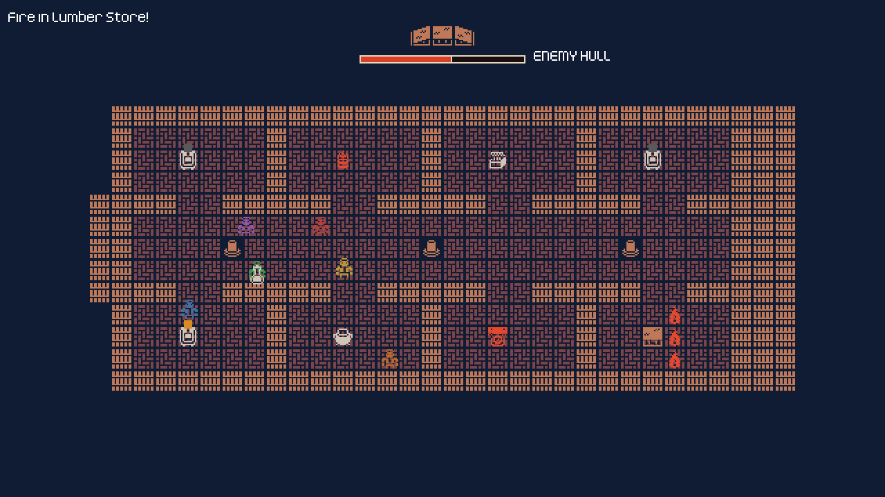

# Scuttle

A six-player couch party game built in Godot 4.7: keep your ship from burning while you work the
guns to sink the enemy. Built by working through *The Ship's Log*, a tutorial in eleven "Watches",
which lives in [`docs/the-ships-log.html`](docs/the-ships-log.html) with my own deviations noted
as "Tune this" callouts. Assets from [Kenney](https://www.kenney.nl/).

## mechanics

- **Scarce stations** - three cannons, one water butt, one magazine, one shot locker; everyone
  wants the same doorway at the same time, and that's the game
- **Cannons** - fetch powder, fetch shot, run the gun out, fire; each trip is a hold at a supply
  station, and the cannon's light shows what it needs next
- **Fire** - enemy broadsides start fires that creep through rooms, doorways and the corridor at a
  steady pace; fill a bucket at the water butt and throw it
- **The magazine** - if fire reaches it, a 10-second fuse starts; put every flame in the room out
  or the ship goes up
- **Bots** - toggle bots on the join screen to fill empty seats; they use the same inputs as a
  player, so they queue, collide and get in the way like anyone else

## controls

| | Move | Interact | Join |
|---|---|---|---|
| Keyboard 1 | WASD | E | Space |
| Keyboard 2 | Arrows | Shift | Enter |
| Gamepad | Left stick | X | A |

Join with two or more players, or one with bots on (B / Y), then press interact to set sail.
R restarts after a battle.

## running

Open `project.godot` in Godot 4.7+ and run. No external dependencies.
